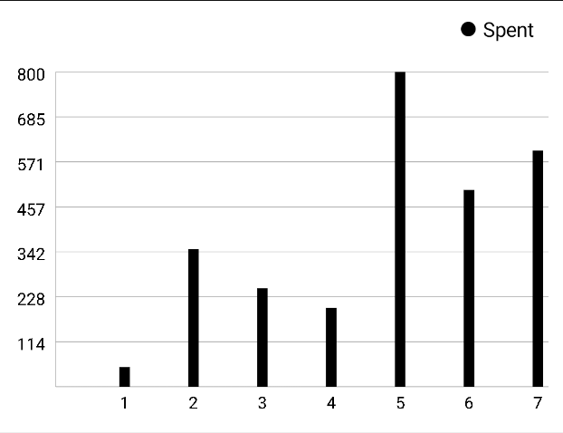

# kwarchart-android

A chart API using Android Jetpack Compose.

# Chart types
1. LineChart

   | Type | Sample |
   | --- | --- |
   | NORMAL |  |
   | SMOOTH |  |
   | AREA |  |

2. BarChart

   | Type | Sample |
   | --- | --- |
   | VERTICAL |    |
   | VERTICAL_STACKED |  |
   | HORIZONTAL |  |
   | HORIZONTAL_STACKED |  |

3. PieChart

   | Type | Sample |
   | --- | --- |
   | NORMAL |  |
   | DOUGHNUT |  |

# Installation
implementation 'com.github.jaimejazarenoiii:kwarchart-android:0.1.0-alpha.1'
